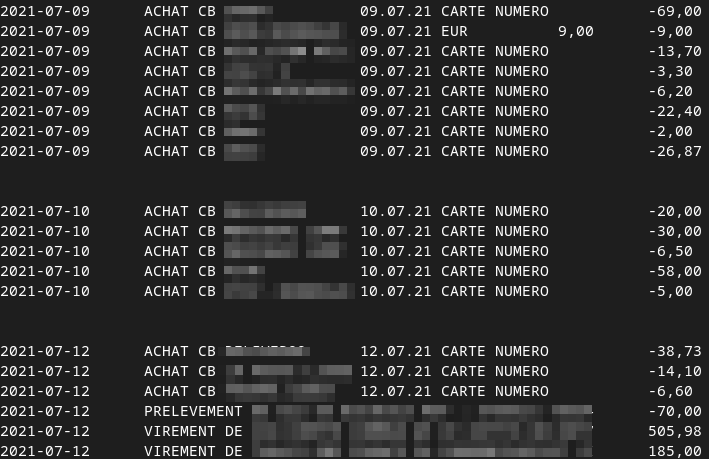

# lpb-csv-sorter

## Description
Script python permettant de trier le fichier CSV de transaction de la banque postale. 
Initialement, le CSV trie les transactions par leur date de prise en compte par la banque et non par la date réèlle de transaction. Cet outil en ligne de commande prend en argument le CSV télécharger depuis le site de la banque postale et affiche dans le terminal la liste des transactions triées par date.

## Screeshots
Fichier CSV de la banque postale :

Sortie du terminal :

